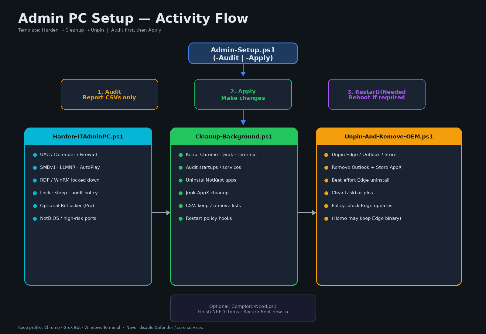

# Admin PC setup

Public Windows **IT admin workstation** toolkit: wipe removable apps, restart, then offer the latest **Grok Bot** and **Google Chrome** (install + pin if you say Yes).

Repo: [`e24g4vewetq3gwerb/Admin-setup`](https://github.com/e24g4vewetq3gwerb/Admin-setup) (public)



---

## Final flow

```
Download / run Admin-Setup.ps1 -Apply -UninstallNotKept -RestartIfNeeded
   │
   ├─ Scan installed apps (Win32 + visible Store/AppX)
   ├─ Remove every removable app (DriversOnly keep: drivers/runtimes only)
   ├─ Clear wallpaper + empty desktop (hide Recycle Bin / all icons)
   ├─ Clear taskbar pins (Start-only for the wipe pass)
   ├─ Disable Remote Desktop Connection client when present
   ├─ Register RunOnce: Offer-GrokAndChrome.ps1
   └─ Restart
         │
         └─ At next logon:
              Check latest Grok Bot + Google Chrome versions
              MessageBox: download both?
                 Yes → install both → pin Chrome + Grok on the taskbar
                 No  → leave Start-only
```

## Quick start (elevated PowerShell)

```powershell
cd $env:USERPROFILE\admin
powershell -ExecutionPolicy Bypass -File .\scripts\Admin-Setup.ps1 -Audit
# Review CSVs, then wipe + restart + post-logon offer:
powershell -ExecutionPolicy Bypass -File .\scripts\Admin-Setup.ps1 -Apply -UninstallNotKept -RestartIfNeeded
```

Cancel a pending reboot with `shutdown /a`.

### Desktop icon (run anytime)

```powershell
powershell -ExecutionPolicy Bypass -File .\scripts\Install-AdminSetup-Shortcut.ps1
```

Creates **Admin Setup** on the Desktop and in the Start Menu. Double-click to run the wipe (UAC prompt). The Grok Bot + Chrome question still appears **only after restart**.

If desktop icons are hidden (bare desktop), open Start and type `Admin Setup`.

### Offer only (no wipe)

```powershell
powershell -ExecutionPolicy Bypass -File .\scripts\Offer-GrokAndChrome.ps1
powershell -ExecutionPolicy Bypass -File .\scripts\Offer-GrokAndChrome.ps1 -RegisterRunOnce
```

### Legacy 3-app dock (Chrome + Cursor + Grok)

```powershell
powershell -ExecutionPolicy Bypass -File .\scripts\Minimal-Taskbar.ps1 -Apply -DockChromeCursorGrok
```

---

## Scripts

| Script | Role |
|--------|------|
| **Admin-Setup.ps1** | Master entry: harden → wipe (`-KeepProfile DriversOnly`) → unpin → StartOnly taskbar → register offer → restart |
| **Cleanup-Background.ps1** | Scan + uninstall; Settings-style app count; disable RDP client; register offer on restart |
| **Clear-Desktop.ps1** | Solid black wallpaper; hide all desktop icons (incl Recycle Bin); empty Desktop folders (keeps Admin Setup.lnk) |
| **Install-AdminSetup-Shortcut.ps1** / **Run-Admin-Setup.cmd** | Desktop + Start Menu icon to run Admin-Setup elevated anytime |
| **Offer-GrokAndChrome.ps1** | Resolve latest Grok + Chrome; Yes/No; install; pin via `-DockChromeGrok` |
| **Offer-GrokBot.ps1** | Compatibility wrapper → Offer-GrokAndChrome.ps1 |
| **Minimal-Taskbar.ps1** | StartOnly (wipe) or `-DockChromeGrok` / `-DockChromeCursorGrok` |
| **Restore-TrayArrowOnly.ps1** | Optional Windhawk up-arrow-only tray |
| **Harden-ITAdminPC.ps1** / **Unpin-And-Remove-OEM.ps1** / **Complete-Need.ps1** | Harden, OEM unpin, leftover NEED items |

### Key switches

| Switch | Effect |
|--------|--------|
| `-KeepProfile DriversOnly` | Wipe user apps; protect drivers/runtimes only (Admin-Setup default) |
| `-UninstallNotKept` | Actually uninstall remove-candidates |
| `-Restart` / `-RestartIfNeeded` | Reboot; registers Grok+Chrome offer for next logon |
| `-DockChromeGrok` | Pin Chrome + Grok Bot (used by the offer script after install) |

### Design rules

1. Run `-Audit` before a destructive wipe.
2. Never disable Defender / SecurityHealth / core Windows services.
3. Edge and some system AppX often cannot uninstall; scripts may hide stubborn ARP entries as a last resort.
4. Grok Bot + Chrome are **not** kept during wipe — they come back only if you click Yes after restart.
5. Windhawk tray restore is optional (`Restore-TrayArrowOnly.ps1`).

---

## Portfolio note

Documents a practical **endpoint wipe + selective reinstall** workflow: clear the machine, then opt in to the latest Grok Bot and Chrome with taskbar pins.
